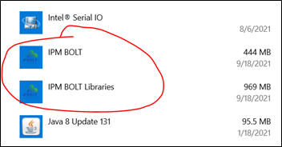
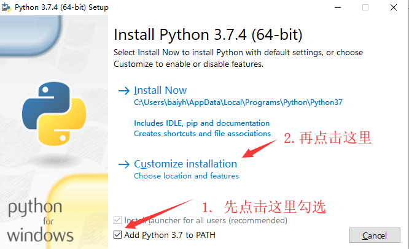
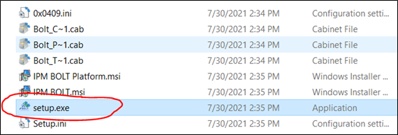
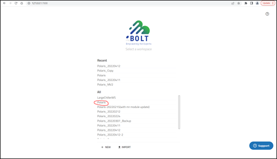
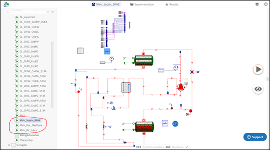
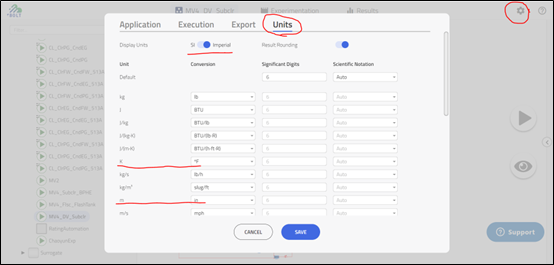
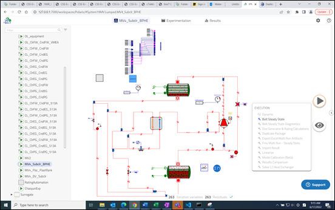
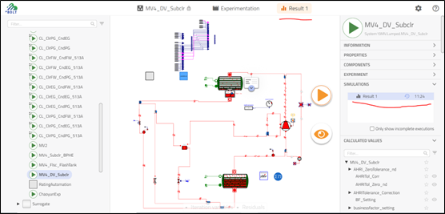
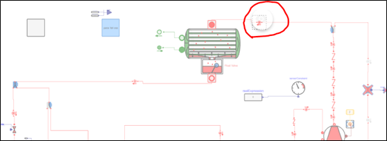
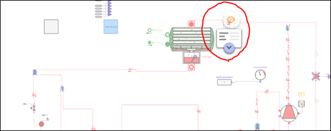

# MV4 Frontier MBD Solution Guidance
## **1. Quick Start**
This guidance assumes that you have nothing installed for MV4 frontiers work.
MV4 frontiers is used for comparing technologies between different sets, e.g., Tonnage / WSPD limitation / tubings. It plays an important role in deciding initial HX concept families from MBD perspective. 
However, in MV4 project, there are lots of challenges in finishing frontier design work:  

1. Fast growing needs in new refrigerant application, other than R134a only; 
2. Highly BOLT application requirements; 
3. Complex tech. combinations evaluation needs. In which, flexible / prompt response to generate frontiers are becoming more and more critical.

With this background, an auto-run frontier tool is developed to quick response to design requirements. It employs python script to operate data manipulation / Bolt multirun / cost analysis automatically, benefits come from: 

1. Engineering resource saving by auto-run; 
2. Prompt response to new needs; 
3. Flexible method to handle input changes; 
4. Traceable version control by code operation; 
5. Potential extended ability with digital tools. 
   
## **2. Python Readiness**
  a. Get python-3.9.2-amd64.exe from below link:

  172.24.236.30\srdc\Large_Chiller\18-MBD(ZXJ)\MBD

  

  b. Contact IT, install python with admin right:

  c. Click “Install Now”, choose ”Add Python 3.9 to Path”:

   

  d. Finish installation by clicking “Disable path length limit”

## **3. VS code readiness**
  a. Better to install VS code for code operation. Copy zip file in sharepoint;

  b. Unzip file and click code.exe to enable vscode;

  c. Click “Extention” in left bar, input “Python”, choose “Python” in the list, and click “Install” to install python script which enables python debug function.

  
  

  d. Choose python version in down left area:

  

  e. Open “run” – “Open configuration”, make sure the content is like this:

  

## **4. xlwings readiness**
  xlwings is an out-source package in python, need installed before applying. It is critical in realizing auto-run.

  a. Open command window: type “cmd” in search bar, and open it: 

  

  b. Type “pip install xlwings”, and click enter button. Notice there are space inside the characters:, turn to ZXJ for any issue, do not waste time in debugging yourself. 

  

  c. Reopen cmd, and type “pip list”, click “Enter”. Then check the list names, make sure xlwings is on the list. 

## **5. Bolt read**
  Please refer to “How to simulate MV4 Bolt models” 

  <https://spcollab.apps.carrier.com/sites/CMLHVACENG/Platforms/WaterCooled/_layouts/15>

## **6. Tubing name in BOLT**
  a.	Necessary to convert EDR tubing name to Bolt name before executing calculation, update in  “MV4_System_Design.xlsm” or “MV4_System_Design_IPLV.xlsm, find below comparison table:

  b.	In frontier session, some common tubes are included which means it will be convert to BOLT names automatically: 

  

## **7. Run MV4 Frontiers**
  a.	Total number of file path characters should be less than 255, otherwise the excel file will not be recognized by system.

  b.	Copy folder “Frontier” to your local disk from sharepoint;

  c.	If R134a system is used, copy all four files under “R134a Template”, and replace below four excel files; 
  If R515B system is used, copy all four files under “R515B Template”, and replace below four excel files; 

  

  d.	Open the excels under “Frontier” folder one by one, during which there should be several updates before take into use, take “BPHE_Subcooler.xlsm” for example: Update cells(1,5) and (1,7) by changing the location address by your own;

  

  e.	Cancel refprop addin.

  f.	Open “MV4_System_Design.xlsm” or “MV4_System_Design_IPLV.xlsm”, change content in “InputTable” sheet, save and close this excel.

  

  g.	Use vscode to open “MV4Frontier.py” under “Frontier” – “MV4_system” folder;

  h.	Choose what kind of frontier curve you want to display, use digit instead:
  Number “0” for first one “BPHE_Subcooler”, “1” for “FlashTank_Flasc”.
  Support multiple choose, [0:2] stands for starting from “BPHE_Subcooler”, ending at “FlashTank_Flasc”(Include), “FlashTank_subcooler” is not included. 

  

  i.	Click “run” – “Start to run without debugging”

  j.	Wait until below bar disappeared, IPLV may need more time: 

  

  k.	If you find that bar disappeared, but there is error message jumped out in the info. Window, and excel is still opened. Should be a bug, Turn to Xijia for immediate solution.

## **8. Tips** 
  a.	Better to separate full load and IPLV type, in other word, run full load or IPLV at one time.

  b.	If you just want to run BOLT simulation without changing frontier summary excel, commented the line with “Runxlframe(sysdesign)”

  

  c.	Make sure solution excels under “Frontier” not changed.

  d.	Make sure solution excels under “Frontier – MV4_system” should be deleted 
  before executing a new calculation.
  
  e.	Same name excel files should be closed before execution.
 
